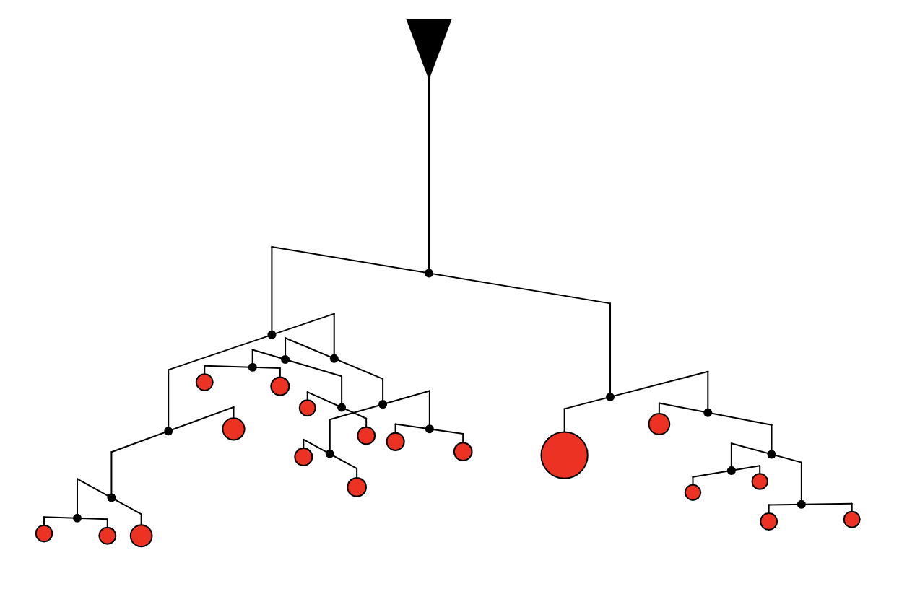
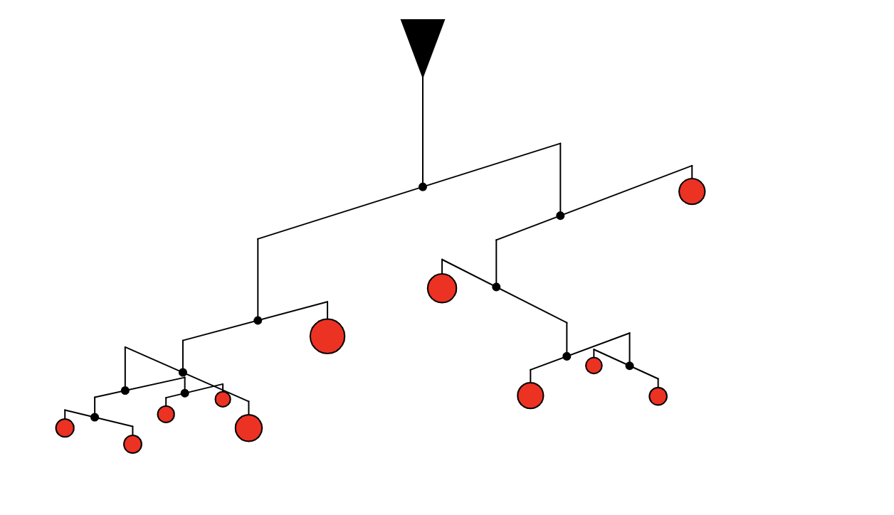

# P5.js experiments with random generation of Calder mobile inspired structure
This code randomly generates 2d representations of mobile structures inspired by the work of Alexander Calder. 

   

The code randomly generates nodes of branches and leaves. Leaves are represented with circles with varying radius. 

The full tree is randomly generated first and terminal leaves are created by attempting to balance the structure with weights. Each circle radius is proportional to its weight and the weight calculation is influenced by the horizontal support angle and where it is connected to its vertical support (connected on left side, middle or right side).

The javascript code relies mostly on P5.js with a custom Node class. Each Node instance has two child nodes (left and right). Each of the child node may either be another node branch or a terminal leaf. 

The creation and vizualization of nodes rely on code recursion.
